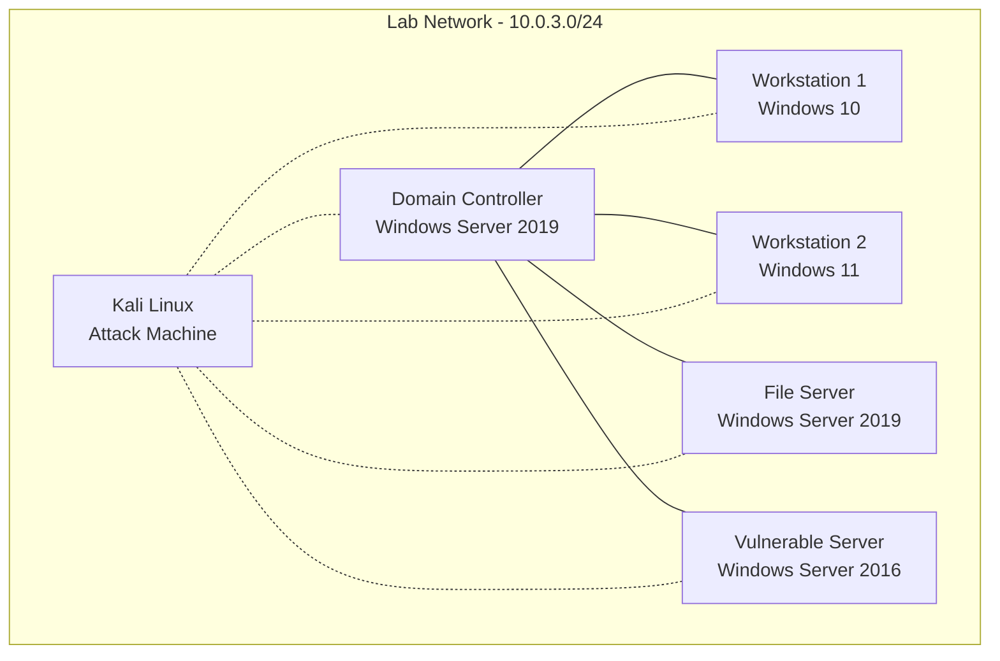

# Active Directory - Penetration Testing Lab

!!! abstract "BLUF"
    **What I built:** A vulnerable Active Directory environment with multiple Windows systems (DC, workstations, servers) for practicing offensive security techniques.  
    **Why it mattered:** Provides hands-on experience with real-world AD attack vectors like Kerberoasting, Pass-the-Hash, and domain enumeration in a safe, isolated environment.  
    **Outcome:** Functional AD domain (MARVEL) with intentional misconfigurations, accessible from Kali Linux attack platform for penetration testing practice and documentation.

---

## Context & Goals

- **Problem:** Need practical experience with Active Directory security testing beyond theoretical knowledge.
- **Goal:** Build an isolated AD environment with realistic vulnerabilities to practice penetration testing methodologies.
- **Constraints:**
    - Isolated network segment (10.0.3.0/24) with no external access for domain systems.
    - Kali attack machine has dual connectivity (internet + lab access).
    - Limited resources on Proxmox host.

---

## Environment Components

!!! note "Network Isolation"
    Kali has access to both internet and AD lab network. AD lab systems (including DC) only have internal LAN access with no external connectivity to simulate enterprise environments.

---

## Design & Decisions

### Domain Infrastructure

- **Domain Name:** MARVEL.local
- **Forest/Domain Functional Level:** Windows Server 2016
- **Domain Controller:** Windows Server 2019 (10.0.3.10)
  - **Roles:** AD DS, DNS, DHCP
  - **Services:** File shares with intentionally weak permissions

### System Inventory

=== "Client Systems"

    | Hostname  | OS             | IP Address  | Purpose          | Vulnerabilities |
    | --------- | -------------- | ----------- | ---------------- | --------------- |
    | Punisher  | Windows 10 Pro | 10.0.3.100  | User workstation | Weak local admin password |
    | Spiderman | Windows 10 Pro | 10.0.3.101  | User workstation | Service account with SPN |

=== "Server Systems"

    | Hostname          | OS                  | IP Address | Purpose                      | Vulnerabilities |
    | ----------------- | ------------------- | ---------- | ---------------------------- | --------------- |
    | Domain Controller | Windows Server 2019 | 10.0.3.10  | AD DS, DNS, DHCP, file shares | Kerberoasting targets, weak GPO |
    | FileServer        | Windows Server 2019 | 10.0.3.102 | SMB shares, sensitive data    | Open shares, weak ACLs |
    | VulnServer        | Windows Server 2016 | 10.0.3.103 | Legacy application server     | Unpatched, weak config |

=== "Attack Platform"

    | Hostname | OS         | IP Address  | Purpose            | Tools |
    | -------- | ---------- | ----------- | ------------------ | ----- |
    | Kali     | Kali Linux | 10.0.3.200  | Penetration testing | nmap, Burp Suite, John the Ripper, Impacket, BloodHound, Responder |

---

## Implementation

### Attack Techniques Practiced

- **Reconnaissance:**
    - Network scanning with nmap
    - LDAP enumeration
    - SMB share discovery

- **Initial Access:**
    - LLMNR/NBT-NS poisoning with Responder
    - Password spraying against domain accounts

- **Privilege Escalation:**
    - Kerberoasting (targeting service accounts)
    - Pass-the-Hash attacks
    - Token impersonation

- **Lateral Movement:**
    - PsExec and WMI execution
    - RDP hijacking
    - Credential dumping with Mimikatz

- **Persistence:**
    - Golden ticket attacks
    - Scheduled task creation
    - Registry autoruns

### Tools & Utilities

=== "Kali-based Tools"

    - **nmap** - Network discovery and port scanning
    - **Burp Suite** - Web application testing (if web apps deployed)
    - **John the Ripper** - Password cracking
    - **Impacket** - Python scripts for SMB, Kerberos attacks
    - **BloodHound** - AD relationship mapping
    - **Responder** - LLMNR/NBT-NS poisoning
    - **CrackMapExec** - Post-exploitation automation

---

## Pitfalls & Fixes

- **Network isolation issues:** Initial setup had lab VMs able to reach internet.  
  *Fix:* Configured Proxmox firewall rules to restrict lab VLAN to internal-only traffic.

- **DHCP conflicts:** DC DHCP conflicted with main network DHCP.  
  *Fix:* Scoped lab DHCP to 10.0.3.50-10.0.3.150 range only.

- **Kali dual-homing:** Needed internet for tool updates but also lab access.  
  *Fix:* Added second network interface to Kali VM (one bridged, one lab VLAN).

---

## Reflection

- **Skills demonstrated:** Active Directory architecture, offensive security techniques, network segmentation, virtualization management.
- **Why this matters:** AD is ubiquitous in enterprise environments; understanding attack vectors is critical for both red team and defensive security roles.
- **Next steps:**
    - Document specific attack chains with screenshots
    - Add more complex attack scenarios (e.g., forest trusts, MSSQL exploitation)
    - Integrate with SIEM for defensive monitoring practice
    - Build detection rules for common AD attacks

---

_Return to [Home](../index.md)_

_Return to [Homelab](../homelab/index.md)_
