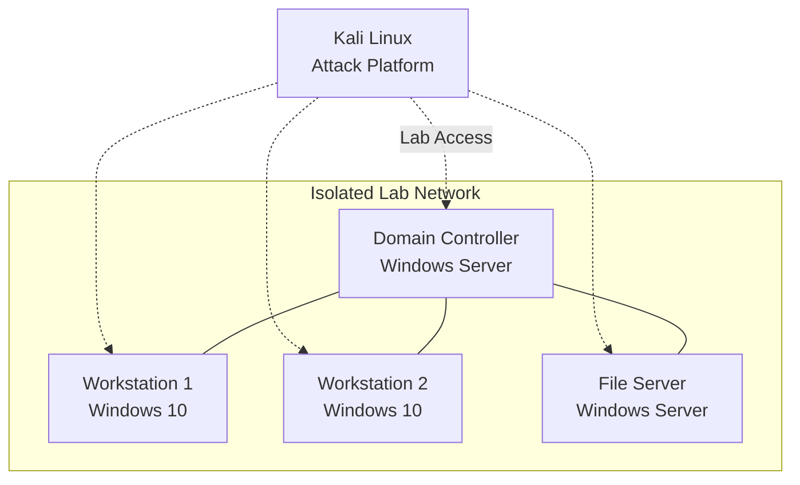

# Active Directory Penetration Testing Lab

## Overview

I built an isolated Active Directory environment with intentional misconfigurations for practicing offensive security techniques. The lab provided hands-on experience with real-world AD attack vectors in a safe, controlled setting.

## What I Built

- **Vulnerable AD domain**: Windows Server domain controller with workstations and servers
- **Isolated network**: Dedicated VLAN with no external connectivity for domain systems
- **Attack platform**: Kali Linux with dual connectivity (internet for tools, lab access for testing)

## Architecture

## Attack Techniques Practiced

### Reconnaissance
- Network scanning and enumeration
- LDAP queries
- SMB share discovery
- BloodHound relationship mapping

### Initial Access
- LLMNR/NBT-NS poisoning
- Password spraying
- Credential harvesting

### Privilege Escalation
- Kerberoasting (service account targeting)
- Pass-the-Hash attacks
- Token impersonation

### Lateral Movement
- PsExec and WMI execution
- Credential dumping
- RDP session hijacking

### Persistence
- Golden ticket attacks
- Scheduled tasks
- Registry modifications

## Tools Used

| Tool | Purpose |
|------|---------|
| **nmap** | Network discovery and port scanning |
| **Impacket** | SMB, Kerberos, and AD attack scripts |
| **BloodHound** | AD relationship mapping and attack path analysis |
| **Responder** | LLMNR/NBT-NS poisoning |
| **CrackMapExec** | Post-exploitation automation |
| **Mimikatz** | Credential extraction |

## Skills Demonstrated

- Active Directory architecture and security
- Offensive security methodology
- Network segmentation for lab isolation
- Virtualization management (Proxmox)

---

_Return to [Homelab Overview](index.md)_
