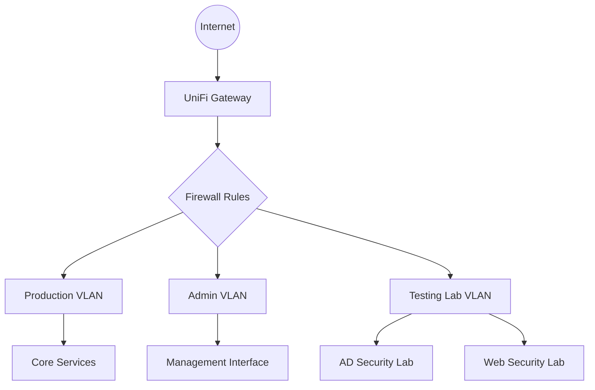

# Security Learning Environment & Homelab

# Infrastructure Overview

My lab is running on Proxmox, a baremetal hypervisor. The hardware is an Intel Hades Canyon NUC - born for gaming, now runs the lab. I have more info below on some of the technology behind this lab.

### Tools & Technologies

- __Networking__:
    - [Pi-hole](pihole.md) - DNS server and domain wide ad-blocking
    - [NGINX Proxy Manager](npm.md) - Port forwarding and reverse proxy 
    - [step-ca PKI](step-ca.md) - Certificate Authority server

- __Virtualization__:
    - Proxmox VE
- __Containerization__:
    - Docker, Proxmox LXC

### Current Learning Focus

#### [Active Directory Lab](activedirectory.md)

- Purpose: Hands-on experience with vulnerable Windows domain controller and machines. Practicing various penetration techniques such as Kerberoasting, Pass-the-hash, and more.

#### [Web Application Security Lab](webapplab.md)

- OWASP Juice Shop hosted on the Kali Linux attack platform hosted on the Kali Linux attack platform.
- Emphasis on testing methodology and documentation

## Environment Overview

### Network Topology

_Return to [Home](../index.md)_
