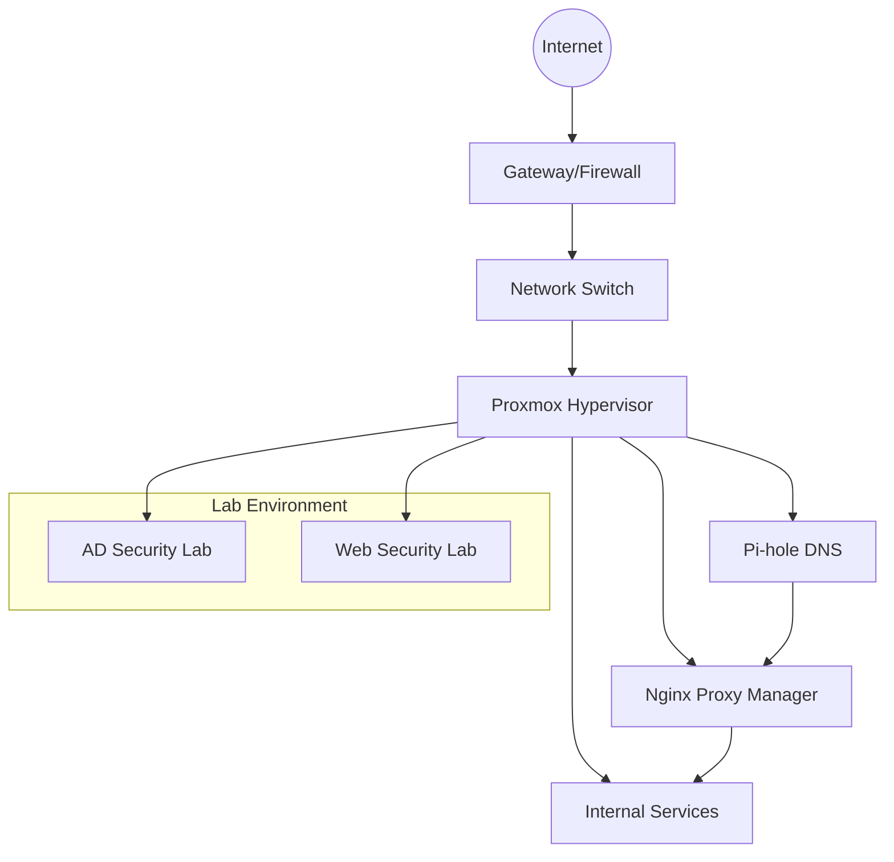

# Security Learning Environment & Homelab

## Infrastructure Overview

My homelab runs on **Proxmox VE**, a bare-metal hypervisor, hosted on an Intel NUC. The environment is designed to mirror enterprise infrastructure patterns while providing a platform for security research and hands-on learning.

### Core Services

- **DNS & Ad Blocking**: [Pi-hole](pihole.md) for centralized DNS resolution and network-wide ad filtering
- **Reverse Proxy**: [Nginx Proxy Manager](npm.md) for TLS termination and hostname-based routing
- **Internal PKI**: Wildcard certificates via mkcert for HTTPS across all internal services
- **Version Control**: Self-hosted Git server for configuration management
- **Documentation**: Internal MkDocs site for runbooks and procedures

### Security Labs

- **[Active Directory Lab](activedirectory.md)**: Vulnerable Windows domain used for practicing penetration testing techniques
- **[Web Application Lab](webapplab.md)**: OWASP Juice Shop for web security testing

## Architecture

## Skills Demonstrated

| Area | Technologies |
|------|--------------|
| **Virtualization** | Proxmox VE, LXC containers, QEMU/KVM |
| **Networking** | DNS management, reverse proxy, VLAN segmentation |
| **PKI/TLS** | Certificate authority, wildcard certs, TLS termination |
| **Security Testing** | Active Directory attacks, web application security |
| **Infrastructure as Code** | Git-based configuration management |

---

_Return to [Home](../index.md)_
