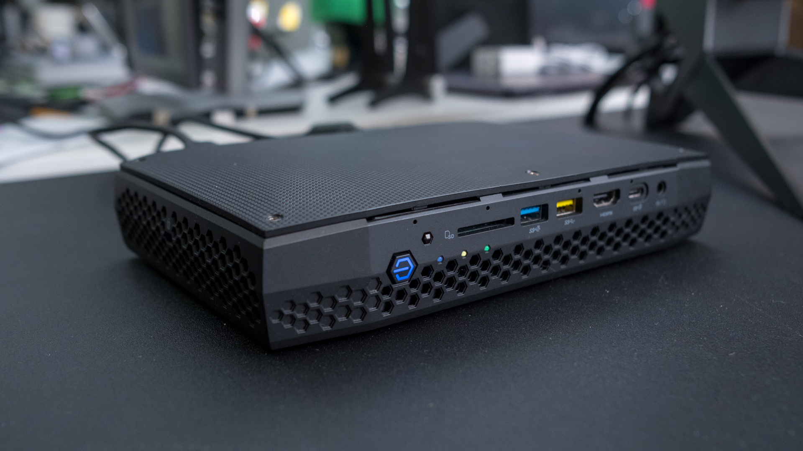
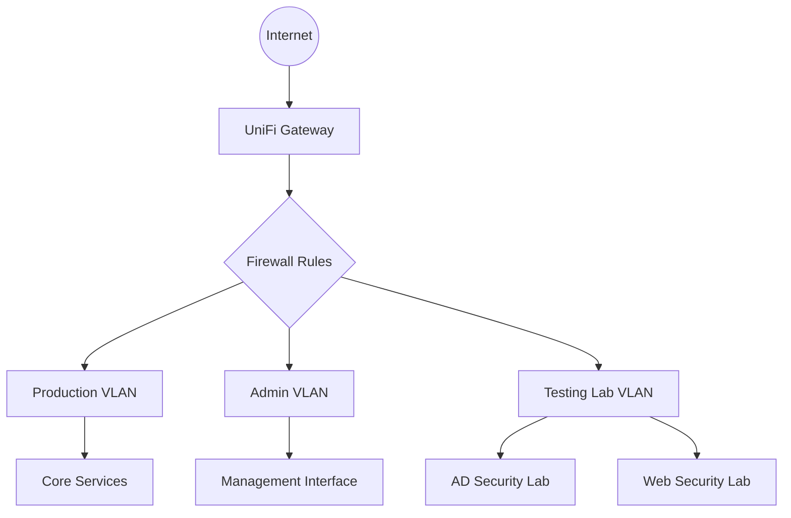

# Security Learning Environment & Homelab

# Infrastructure Overview

My lab is running on Proxmox, a baremetal hypervisor. The hardware is an Intel Hades Canyon NUC - born for gaming, now runs the lab.

### Tools & Technologies

- Virtualization: Proxmox VE
- Penetration Testing: Kali Linux, Burp Suite, Metasploit, Nmap
- Networking: Pi-hole, NGINX, Step-CA
- Containerization: Docker, Proxmox LXC

### Current Learning Focus

#### [Active Directory Lab](activedirectory.md)

- Purpose: Hands-on experience with vulnerable Windows domain controller and machines. Practicing various penetration techniques such as Kerberoasting, Pass-the-hash, and more.

#### [Web Application Security Lab](webapplab.md)

- OWASP Juice Shop with Burp Suite and FoxyProxy setup
- Key vulnerability focus areas:
    - SQL Injection and authentication attacks
    - Data exposure and XXE vulnerabilities
    - Access control and security misconfigurations
    - Cross-Site Scripting (XSS) techniques
- Emphasis on testing methodology and documentation
- Hands-on experience with baremetal hypervisor (Proxmox) and provisioning of internal/services

## Environment Overview

### Network Topology

## Network Segmentation

| VLAN       | Purpose                      | Security Controls                                                                      |
| ---------- | ---------------------------- | -------------------------------------------------------------------------------------- |
| Production | Core infrastructure services | • Strict firewall rules • Limited external access • Service isolation            |
| Admin      | Management access            | • Admin-only access • Restricted to authorized devices • Enhanced authentication |
| Lab        | Security testing environment | • Completely isolated • No internet access • Sandboxed environment               |

---

---

_Return to [Home](../index.md)_
