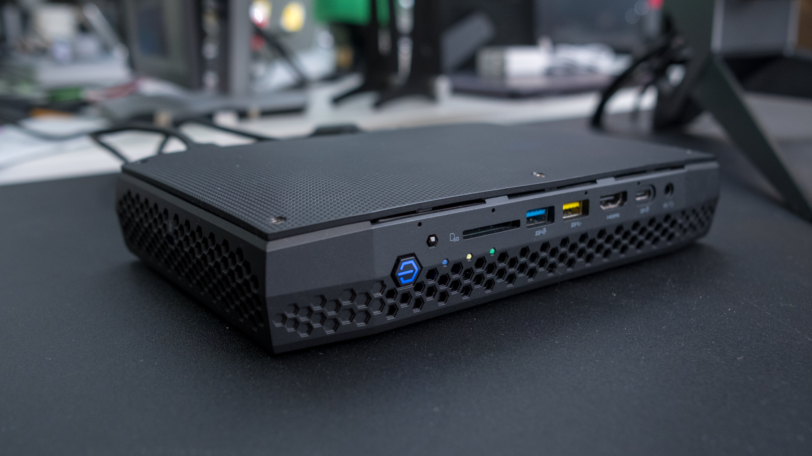
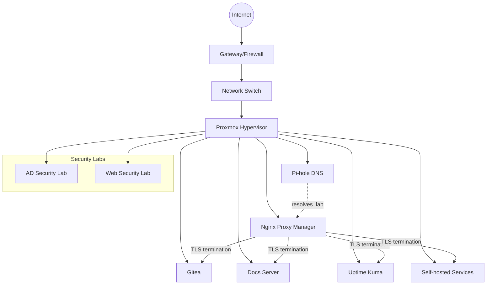

# Homelab

## Infrastructure Overview

My homelab runs on **Proxmox VE**, a bare-metal hypervisor hosted on an Intel NUC. The environment manages a dozen+ LXC containers and VMs across infrastructure services, self-hosted applications, and security labs. All services are accessed over HTTPS via internal `.lab` domains.

### Platform and Infrastructure

- **DNS**: Pi-hole for centralized DNS resolution and network-wide ad filtering. All `.lab` domains resolve through Pi-hole to the reverse proxy.
- **Reverse Proxy / TLS**: Nginx Proxy Manager handles hostname-based routing and SSL termination using a `*.lab` wildcard certificate from a local CA (mkcert).
- **Monitoring**: Uptime Kuma tracks service availability with HTTP health checks across all web-accessible services.
- **Version Control**: Self-hosted Gitea instance for configuration and documentation repositories.
- **Documentation**: Internal MkDocs site built locally and deployed via rsync to a dedicated nginx server. Covers runbooks, service procedures, and network topology.
- **[Remote Access](remote-access.md)**: Tailscale mesh VPN for reaching select services from outside the LAN — no ports exposed to the internet.

### Service Management

The environment runs a mix of self-hosted applications including media servers, document management, and utility services. Each service follows a standardized lifecycle: provisioning, DNS registration, reverse proxy configuration, monitoring setup, and documentation. Services are decommissioned through the reverse of that process to prevent drift.

Operational tasks like patching, inventory reporting, and VPN device management are handled through custom Bash tooling run from the Proxmox host.

### Docker and Containers

Most services run as LXC containers directly on Proxmox. A multi-container Docker Compose stack runs on a dedicated VM with WireGuard VPN integration. NFS shares provide read-only access to other containers without duplicating data.

### Deployment Workflows

The lab uses two separate documentation pipelines:

- **Portfolio site** (this site): GitHub Actions workflow triggers on push to main, builds MkDocs, and deploys to GitHub Pages automatically.
- **Internal docs** (docs.lab): Built locally with MkDocs and deployed via rsync to a dedicated nginx server on the homelab.

### Security Labs

- **[Security Labs](security-labs.md)**: Decommissioned PEH coursework — a vulnerable Active Directory domain and an OWASP Juice Shop web app

## Architecture

```mermaid
graph TD
    INTERNET((Internet)) --> ROUTER[Gateway/Firewall]
    ROUTER --> SWITCH[Network Switch]
    SWITCH --> PROXMOX[Proxmox Hypervisor]

    PROXMOX --> DNS[Pi-hole DNS]
    PROXMOX --> PROXY[Nginx Proxy Manager]
    PROXMOX --> GITEA[Gitea]
    PROXMOX --> DOCS[Docs Server]
    PROXMOX --> MONITOR[Uptime Kuma]
    PROXMOX --> SERVICES[Self-hosted Services]

    DNS -.->|resolves .lab| PROXY
    PROXY -->|TLS termination| GITEA
    PROXY -->|TLS termination| DOCS
    PROXY -->|TLS termination| MONITOR
    PROXY -->|TLS termination| SERVICES

    subgraph Security Labs
        ADLAB[AD Security Lab]
        WEBLAB[Web Security Lab]
    end

    PROXMOX --> ADLAB
    PROXMOX --> WEBLAB
```

## Skills Demonstrated

| Area | Technologies |
|------|--------------|
| **Virtualization** | Proxmox VE, LXC containers, QEMU/KVM |
| **Networking** | DNS management, reverse proxy, TLS termination, VPN tunnels |
| **Containers** | LXC provisioning, Docker Compose, NFS mounts, GPU passthrough |
| **Monitoring** | Uptime Kuma, service health checks |
| **CI/CD and Tooling** | GitHub Actions, MkDocs build/deploy pipelines, Git workflows, Bash automation |
| **Security** | Active Directory attack lab, web application testing, wildcard PKI |
| **Remote Access** | Tailscale mesh VPN |

## Where this is heading

The lab is a moving target. Two concrete next steps on the list:

- **Proper backups and disaster recovery** — scheduled, tested backups of container/VM state and service data, so a failed host or a bad change is a restore, not a rebuild. Right now this is the biggest gap between "homelab" and "production-minded."
- **Remote `.lab` DNS over Tailscale** — point Tailscale's DNS at [Pi-hole](pihole.md) (split DNS) so `service.lab` names resolve over the VPN, not just on the LAN. Today remote access means connecting by Tailscale IP; this closes that gap so off-network access feels identical to being home.

---

_Return to [Home](../index.md)_
