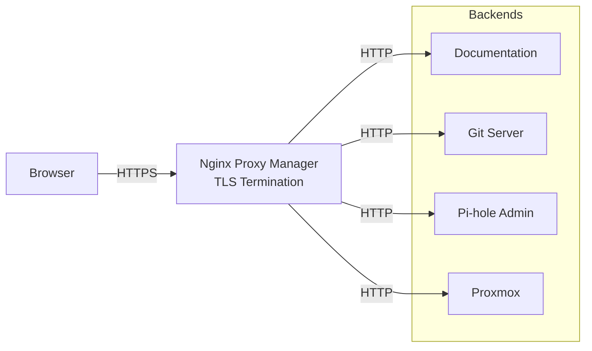

# Nginx Proxy Manager (Reverse Proxy)

## Why a reverse proxy

Once [Pi-hole](pihole.md) was resolving `.lab` hostnames, services were reachable as `myhome.lab:8001` — better than raw IPs, but with two problems left: I had to remember a port for every service, and everything was still plain HTTP. I wanted them to behave like real websites — `https://myhome.lab`, no port, no warnings.

Nginx Proxy Manager solved both. Every `.lab` hostname points at NPM (see [Pi-hole](pihole.md)), and from there NPM:

- routes each hostname to the right backend IP and port, and
- terminates TLS with the [`*.lab` wildcard certificate](pki.md), so the port disappears and the connection is HTTPS.

`myhome.lab:8001` became `https://myhome.lab`, and the same pattern scaled to every service after it.

I stayed with NPM rather than reaching for Caddy or Traefik. Pi-hole was already handling DNS for the network, and NPM's web UI made per-host setup quick without hand-writing nginx config files — the two tools split DNS and ingress cleanly without overlapping.

## Architecture


```mermaid
graph LR
    BROWSER[Browser] -->|HTTPS| NPM[Nginx Proxy Manager<br/>TLS Termination]

    subgraph Backends
        DOCS[Documentation]
        GIT[Git Server]
        DNS[Pi-hole Admin]
        HYPERVISOR[Proxmox]
    end

    NPM -->|HTTP| DOCS
    NPM -->|HTTP| GIT
    NPM -->|HTTP| DNS
    NPM -->|HTTP| HYPERVISOR
```

## Proxy host configuration

Each service gets a proxy host in NPM with:

- **Domain**: `service.lab`
- **Forward target**: the backend IP and port, over plain HTTP
- **SSL**: the `*.lab` wildcard cert, with Force SSL, HSTS, and HTTP/2
- **Block Common Exploits** enabled
- **Websockets Support** where the service needs it

## Per-service quirks

Most services proxy cleanly with those defaults, but a couple needed per-host tweaks in NPM's **Advanced** tab:

- **HTTPS-only backends fail upstream TLS verification.** Most backends speak plain HTTP, but a few only serve HTTPS with their own self-signed certs (the Proxmox UI on `:8006`, for instance). NPM won't proxy to an untrusted upstream by default, so those hosts need `proxy_ssl_verify off;`. The trust boundary that matters is already the wildcard cert at the front door — verifying the internal hop to a box I control adds nothing.
- **Pi-hole's dashboard lives at `/admin`.** Hitting `https://pihole.lab/` returns a 403, because Pi-hole serves its UI from `/admin`, not `/`. A one-line redirect on the proxy host fixes it:

    ```nginx
    location = / { return 301 /admin; }
    ```

Real-time UIs also need the **Websockets Support** toggle, which is part of the per-host checklist above.

---

_Return to [Homelab Overview](index.md)_
