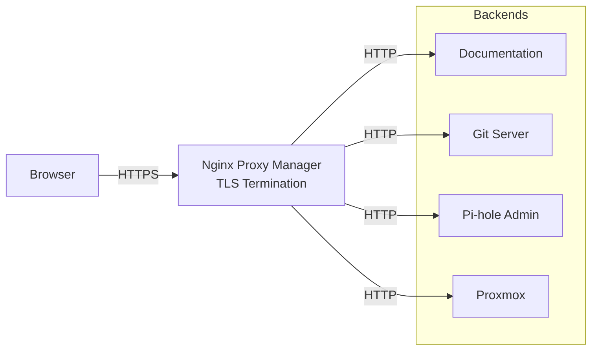

# Nginx Proxy Manager (Reverse Proxy)

## Overview

Nginx Proxy Manager serves as the central ingress point for all homelab services, providing TLS termination and hostname-based routing through a web-based management interface.

## What I Built

- **Centralized ingress**: All internal services accessed via `https://<service>.lab`
- **TLS termination**: Wildcard certificate handles HTTPS for all services
- **Simplified management**: Web UI for proxy host configuration without manual nginx configs

## Architecture

## Key Decisions

- **Internal-only access**: No WAN exposure; accessible only on LAN
- **Wildcard certificate**: Single cert covers all `.lab` subdomains via mkcert
- **Backend flexibility**: Services run on HTTP internally; NPM handles all encryption

## Proxy Host Configuration

Each service configured with:

- Hostname-based routing
- SSL certificate assignment
- Force SSL and HSTS
- WebSocket support where needed (Git, real-time services)
- Common exploit blocking

## Skills Demonstrated

- Reverse proxy design and implementation
- TLS termination architecture
- Certificate management
- Secure internal ingress patterns

---

_Return to [Homelab Overview](index.md)_
