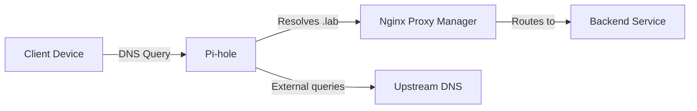

# Pi-hole (DNS & Ad Blocking)

## Overview

Pi-hole provides centralized DNS resolution and network-wide ad blocking for the homelab. All internal `.lab` domains resolve through Pi-hole to the reverse proxy for clean hostname-based access.

## What I Built

- **Centralized DNS**: All internal services accessible via friendly hostnames instead of IP:port combinations
- **Ad Blocking**: Network-wide filtering of ads and telemetry at the DNS level
- **Reverse Proxy Integration**: DNS records point to Nginx Proxy Manager, which handles routing and TLS termination

## Architecture

## Key Decisions

- **Local-only domain**: Using `.lab` TLD for internal services (no external resolution needed)
- **Single point of entry**: All hostnames resolve to the reverse proxy, not directly to services
- **Upstream fallback**: Non-local queries forwarded to public DNS

## Skills Demonstrated

- DNS server administration
- Network-wide traffic management
- Integration with reverse proxy architecture
- Ad blocking and privacy filtering

---

_Return to [Homelab Overview](index.md)_
