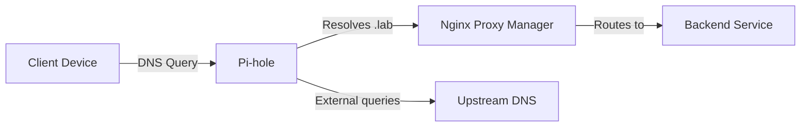

# Pi-hole (DNS & Ad Blocking)

## Why Pi-hole

It started as an ad blocker. Running Pi-hole as the network's DNS server filters ads and telemetry for every device at once — no per-device browser extensions, no per-app settings.

The second use only became obvious once it was running: Pi-hole is also a local DNS server. Instead of memorizing which service lived at which IP and port, I could point a friendly `.lab` hostname at it. `192.168.x.x:8001` became `myhome.lab:8001`. That alone made the lab usable day to day.

## From direct IPs to a single front door

The first version of my DNS setup pointed each `.lab` hostname straight at the service's own IP. It worked, but it had three problems:

- Every service was still `hostname.lab:<port>` — I had to remember the port for each one.
- Everything was plain `http://` — no TLS.
- If a service moved to a different host, I had to go update its DNS record.

The fix was to stop pointing DNS at the services and point it at **one place** instead — a reverse proxy ([Nginx Proxy Manager](npm.md)). Now every `.lab` record resolves to the proxy's single IP, and the proxy handles routing each hostname to the right backend, terminating TLS, and absorbing the port. `myhome.lab:8001` became `https://myhome.lab`, and the same pattern scaled to every service after it.

!!! note "The decision: DNS points at the proxy, not the service"
    This is the single change that made everything else clean. If the proxy moves, one IP changes — not every DNS record. If a backend moves, only the proxy's forward target changes — DNS doesn't move at all. The same principle drives the [service lifecycle](service-lifecycle.md): no service gets a DNS record pointing anywhere but the proxy.

I kept this Pi-hole + NPM pairing rather than reaching for something like Caddy or Traefik. Pi-hole was already handling DNS for the whole network, so layering another DNS-aware router on top would have been redundant — the two tools split the job cleanly: Pi-hole resolves names, NPM routes and encrypts.

## Architecture

```mermaid
graph LR
    CLIENT[Client Device] -->|DNS Query| PIHOLE[Pi-hole]
    PIHOLE -->|Resolves .lab| NPM[Nginx Proxy Manager]
    NPM -->|Routes to| SERVICE[Backend Service]

    PIHOLE -->|External queries| UPSTREAM[Upstream DNS]
```

## Configuration notes

- **Records added individually.** Each new service gets a manual `.lab` entry pointing at the proxy. With a small service count that's simpler than automating it, and it's a fixed step in the [service lifecycle](service-lifecycle.md) so nothing gets missed.
- **Default blocklists.** The out-of-the-box lists catch the bulk of ads and telemetry without tuning — I haven't needed to add custom lists.
- **Whitelisting when a block breaks something.** Occasionally a default list is too aggressive. The *Wall Street Journal* comment section, for example, wouldn't load until I whitelisted the domain it depended on. Pi-hole's query log makes it straightforward to spot which blocked domain caused the breakage and whitelist just that one.

## A gotcha worth knowing: DHCP breaks `.lab`

The most common way `.lab` resolution breaks is a container left on DHCP. It picks up the router's DNS instead of Pi-hole, and `.lab` names quietly stop resolving — `getaddrinfo ENOTFOUND`, with monitoring checks, proxy lookups, and API calls all failing at once. The fix is consistent: give every container a static IP with Pi-hole as its nameserver, pinned in the container config so a reboot can't silently undo it.

---

_Return to [Homelab Overview](index.md)_
