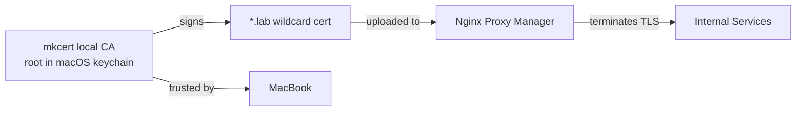

# Internal PKI (Certificate Management)

## Why a local CA

I wanted lab services to load as `https://service.lab` with no browser warnings — to feel like real websites instead of "your connection is not private" click-throughs. That means each [reverse proxy](npm.md) host needs a TLS certificate to terminate HTTPS.

The catch: `.lab` is an internal-only domain. No public certificate authority — Let's Encrypt included — will issue a certificate for a name it can't validate on the public internet. So the certificate has to come from a CA I run myself, one my devices are told to trust.

## How it's set up

I used **[mkcert](https://github.com/FiloSottile/mkcert)** on my MacBook. mkcert does two things:

1. Creates a local certificate authority and installs its root into the machine's trust store (the macOS keychain), so the browser trusts anything that CA signs.
2. Issues certificates signed by that CA.

I generated a single **wildcard `*.lab` certificate** — valid for every `service.lab` hostname — and uploaded the cert and key into Nginx Proxy Manager. NPM presents it on every proxy host and terminates TLS there; the backends still speak plain HTTP internally.

## Decisions and trade-offs

- **One wildcard over per-service certs.** A single `*.lab` cert covers every current and future service, so adding a service never means issuing a new certificate — NPM just serves the existing one on the new hostname.
- **Trust is per-device, and that's the cost.** mkcert installed the CA root on my MacBook automatically — the one machine I use to reach the lab — so everything Just Works there. The trade-off: any *other* device would show certificate warnings until I install the same CA root on it. For a single-user lab that's an acceptable limitation; if I needed multi-device trust regularly, I'd distribute the root or move to a real domain with public ACME certificates.
- **mkcert over a full CA stack.** Standing up step-ca or a hand-rolled OpenSSL CA would be more "enterprise," but for a handful of internal services mkcert delivers the same browser-trusted result with far less to maintain.

---

_Return to [Homelab Overview](index.md)_
