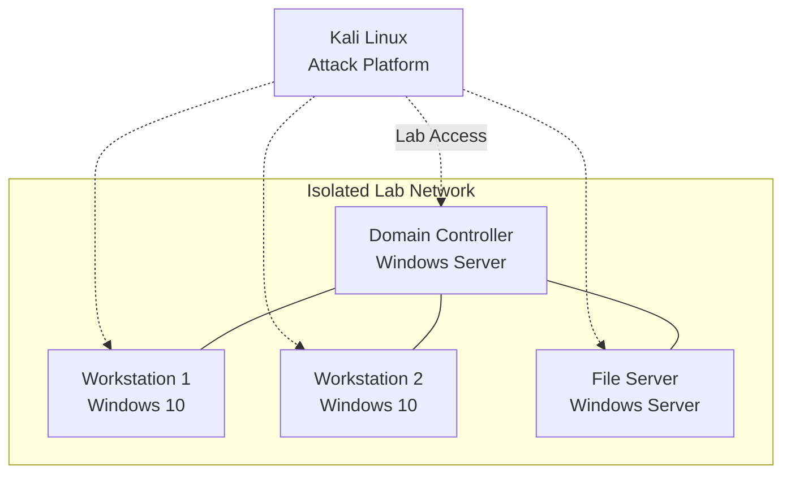
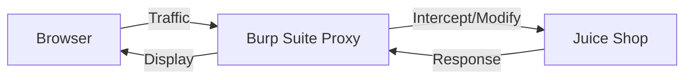

# Security Labs

!!! note "Status: decommissioned"
    These labs were built to work through the TCM Security *Practical Ethical Hacking* course, then torn down once I finished. They're documented here as past work, not running services — decommissioned through the same [service lifecycle](service-lifecycle.md) process as everything else in the lab, with no orphaned DNS records, monitors, or VMs left behind.

---

## Active Directory Lab

An isolated Active Directory environment with intentional misconfigurations, built to practice offensive security techniques in a safe, controlled setting.

**What I built:**

- **Vulnerable AD domain**: Windows Server domain controller with workstations and servers
- **Isolated network**: Dedicated VLAN with no external connectivity for domain systems
- **Attack platform**: Kali Linux with dual connectivity (internet for tools, lab access for testing)

**What I practiced:** a full attack chain end to end — reconnaissance and enumeration (network scanning, LDAP queries, SMB share discovery, BloodHound mapping), initial access via LLMNR/NBT-NS poisoning and password spraying, privilege escalation through Kerberoasting and pass-the-hash, lateral movement with PsExec and WMI, and persistence via golden tickets.

| Tool | Purpose |
|------|---------|
| **nmap** | Network discovery and port scanning |
| **Impacket** | SMB, Kerberos, and AD attack scripts |
| **BloodHound** | AD relationship mapping and attack path analysis |
| **Responder** | LLMNR/NBT-NS poisoning |
| **CrackMapExec** | Post-exploitation automation |
| **Mimikatz** | Credential extraction |

---

## Web Application Lab

OWASP Juice Shop deployed as a deliberately vulnerable web application, with Burp Suite as an intercepting proxy, to work through the OWASP Top 10.

**What I built:**

- **Vulnerable web application**: OWASP Juice Shop with intentional security flaws
- **Testing environment**: Burp Suite configured as intercepting proxy
- **Structured methodology**: Following the OWASP Testing Guide for assessments

**What I practiced:** the OWASP Top 10 using Burp to intercept and tamper requests — injection (SQLi, command injection, XXE), broken authentication and JWT manipulation, access-control flaws (IDOR, path traversal), client-side attacks (XSS, CSRF), and common misconfigurations. sqlmap and OWASP ZAP filled in automated testing.

| Tool | Purpose |
|------|---------|
| **Burp Suite** | Traffic interception, request manipulation |
| **sqlmap** | Automated SQL injection testing |
| **OWASP ZAP** | Alternative web proxy and scanner |
| **curl** | Manual HTTP request crafting |
| **Nikto/dirb** | Web server scanning and enumeration |

---

## Resources

- [Practical Ethical Hacking — TCM Security](https://academy.tcm-sec.com/p/practical-ethical-hacking-the-complete-course)
- [PimpmyADLab Build Script](https://github.com/Dewalt-arch/pimpmyadlab?tab=readme-ov-file)
- [OWASP Juice Shop](https://owasp.org/www-project-juice-shop/)
- [OWASP Testing Guide](https://owasp.org/www-project-web-security-testing-guide/)
- [PortSwigger Web Security Academy](https://portswigger.net/web-security)

---

_Return to [Homelab Overview](index.md)_
