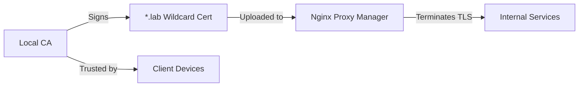

# Internal PKI (Certificate Management)

## Overview

The homelab uses locally-trusted certificates for HTTPS across all internal services. This provides browser-trusted TLS without relying on public certificate authorities for internal-only domains.

## What I Built

- **Local Certificate Authority**: Trusted CA installed in client trust stores
- **Wildcard certificate**: Single `*.lab` cert covers all internal services
- **TLS termination**: Certificates loaded into Nginx Proxy Manager for centralized SSL handling

## Architecture

## How It Works

1. Local CA created and installed in client trust stores (macOS Keychain, browsers)
2. Wildcard certificate generated for `*.lab` domain
3. Certificate uploaded to Nginx Proxy Manager
4. NPM terminates SSL; backends run on HTTP internally
5. Clients trust the connection via the installed CA root

## Key Decisions

- **Simplicity over automation**: Manual cert issuance sufficient for small service count
- **Wildcard approach**: One certificate covers all services, reducing management overhead
- **Client trust distribution**: CA root manually installed on devices that need access

## Skills Demonstrated

- PKI hierarchy design (root CA, leaf certificates)
- Certificate lifecycle management
- TLS termination architecture
- Trust distribution across clients

---

_Return to [Homelab Overview](index.md)_
