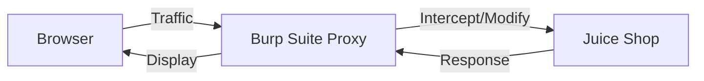

# Web Application Security Lab

## Overview

OWASP Juice Shop deployed as a vulnerable web application for practicing security testing. The lab provides hands-on experience with OWASP Top 10 vulnerabilities using industry-standard tools and methodologies.

## What I Built

- **Vulnerable web application**: OWASP Juice Shop with intentional security flaws
- **Testing environment**: Burp Suite configured as intercepting proxy
- **Structured methodology**: Following OWASP Testing Guide for assessments

## Architecture

## Vulnerability Categories Practiced

### Injection Attacks
- SQL Injection (authentication bypass, data extraction)
- Command injection
- XXE (XML External Entity)

### Authentication & Session Management
- Broken authentication
- Session fixation
- JWT manipulation
- Brute force attacks

### Access Control
- IDOR (Insecure Direct Object Reference)
- Privilege escalation
- Path traversal
- Missing function-level access control

### Client-Side Attacks
- XSS (Reflected, Stored, DOM-based)
- CSRF (Cross-Site Request Forgery)
- Clickjacking
- Open redirects

### Security Misconfigurations
- Information disclosure
- Insecure file upload
- CORS misconfiguration
- Missing security headers

## Tools Used

| Tool | Purpose |
|------|---------|
| **Burp Suite** | Traffic interception, request manipulation |
| **sqlmap** | Automated SQL injection testing |
| **OWASP ZAP** | Alternative web proxy and scanner |
| **curl** | Manual HTTP request crafting |
| **Nikto/dirb** | Web server scanning and enumeration |

## Testing Methodology

1. **Reconnaissance**: Map application structure, identify input vectors
2. **Vulnerability Identification**: Test for OWASP Top 10
3. **Exploitation**: Demonstrate impact of findings
4. **Documentation**: Record findings with severity ratings
5. **Remediation Research**: Document proper fixes

## Skills Demonstrated

- Web application security testing
- Intercepting proxy usage
- OWASP Top 10 vulnerability identification and exploitation
- Security assessment documentation

## Resources

- [OWASP Juice Shop](https://owasp.org/www-project-juice-shop/)
- [OWASP Testing Guide](https://owasp.org/www-project-web-security-testing-guide/)
- [PortSwigger Web Security Academy](https://portswigger.net/web-security)

---

_Return to [Homelab Overview](index.md)_
