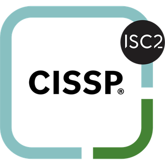

# **Mario Torres**

*[CISSP-certified identity and security professional](about/) with 5 years of enterprise operations experience at Fidelity Investments, supporting 70,000 users across identity, access, and security platforms. Building infrastructure and automation skills through a personal [homelab](homelab/index.md).*

## Quick Navigation

-   :material-information-variant-box:{ .lg .middle } __About Me__

    ---

    5 years of enterprise IT operations at Fidelity Investments. CISSP-certified, with hands-on infrastructure experience through a personal homelab.

    [:octicons-arrow-right-24: Profession and Education](about/)

-   :material-certificate:{ .lg .middle } __Certifications__

    ---

    CISSP — Certified Information Systems Security Professional (ISC2)

    [:octicons-arrow-right-24: View certifications](certifications/)

    { width="80" }

-   :material-server-network:{ .lg .middle } __Homelab__

    ---
    Proxmox hypervisor running containerized services, DNS, reverse proxy, monitoring, and security labs.

    [:octicons-arrow-right-24: Lab details](homelab/index.md)

